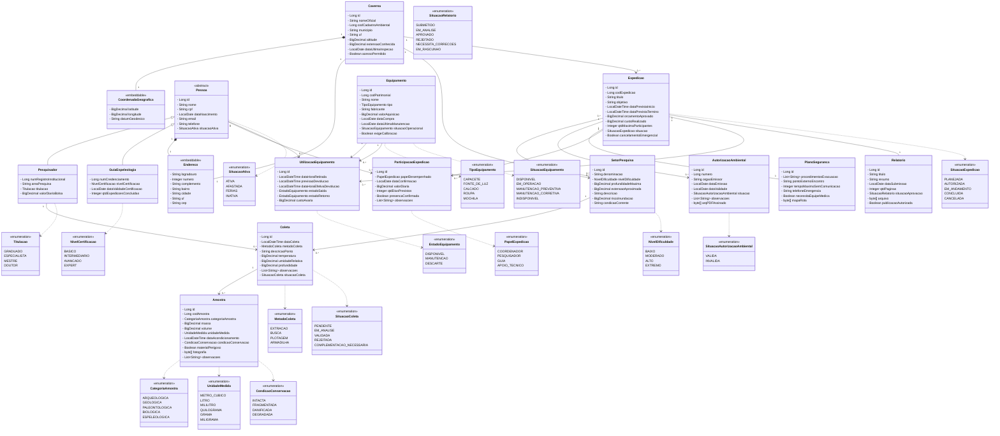

# Diagrama de Classes

```mermaid
classDiagram

    class Caverna {
        - Long id
        - String nomeOficial
        - Long codCadastroAmbiental
        - String municipio
        - String uf
        - BigDecimal altitude
        - BigDecimal extensaoConhecida
        - LocalDate dataUltimaInspecao
        - Boolean acessoPermitido
    }

    class CoordenadaGeografica {
        <<embeddable>>
        - BigDecimal latitude
        - BigDecimal longitude
        - String datumGeodesico
    }

    class SetorPesquisa {
        - Long id
        - String denominacao
        - NivelDificuldade nivelDificuldade
        - BigDecimal profundidadeMaxima
        - BigDecimal extensaoAproximada
        - String descricao
        - BigDecimal riscoInundacao
        - String condicaoCorrente
    }

    class NivelDificuldade {
        <<enumeration>>
        BAIXO
        MODERADO
        ALTO
        EXTREMO
    }

    class Pessoa {
        <<abstract>>
        - Long id
        - String nome
        - String cpf
        - LocalDate dataNascimento
        - String email
        - String telefone
        - SituacaoAtiva situacaoAtiva
    }

    class SituacaoAtiva {
        <<enumeration>>
        ATIVA
        AFASTADA
        FERIAS
        INATIVA
    }

    class Endereco {
        <<embeddable>>
        - String logradouro
        - Integer numero
        - String complemento
        - String bairro
        - String cidade
        - String uf
        - String cep
    }

    class Pesquisador {
        - Long numRegistroInstitucional
        - String areaPesquisa
        - Titulacao titulacao
        - BigDecimal valorDiarioBolsa
    }

    class Titulacao {
        <<enumeration>>
        GRADUADO
        ESPECIALISTA
        MESTRE
        DOUTOR
    }

    class GuiaEspeleologia {
        - Long numCredenciamento
        - NivelCertificacao nivelCertificacao
        - LocalDate dataValidadeCertificacao
        - Integer qtdExpedicoesConcluidas
    }

    class NivelCertificacao {
        <<enumeration>>
        BASICO
        INTERMEDIARIO
        AVANCADO
        EXPERT
    }

    class Expedicao {
        - Long id
        - Long codExpedicao
        - String titulo
        - String objetivo
        - LocalDateTime dataPrevistaInicio
        - LocalDateTime dataPrevistaTermino
        - BigDecimal orcamentoAprovado
        - BigDecimal custoRealizado
        - Integer qtdMaximaParticipantes
        - SituacaoExpedicao situacao
        - Boolean cancelamentoEmergencial
    }

    class SituacaoExpedicao {
        <<enumeration>>
        PLANEJADA
        AUTORIZADA
        EM_ANDAMENTO
        CONCLUIDA
        CANCELADA
    }

    class AutorizacaoAmbiental {
        - Long id
        - Long numero
        - String orgaoEmissor
        - LocalDate dataEmissao
        - LocalDate dataValidade
        - SituacaoAutorizacaoAmbiental situacao
        - List~String~ observacoes
        - byte[] arqPDFAssinado
    }

    class SituacaoAutorizacaoAmbiental {
        <<enumeration>>
        VALIDA
        INVALIDA
    }

    class PlanoSeguranca {
        - Long id
        - List~String~ procedimentosEvacuacao
        - String pontoExternoEncontro
        - Integer tempoMaximoSemComunicacao
        - String telefoneEmergencia
        - Boolean necessitaEquipeMedica
        - byte[] mapaRota
    }

    class ParticipacaoExpedicao {
        - Long id
        - PapelExpedicao papelDesempenhado
        - LocalDate dataConfirmacao
        - BigDecimal valorDiaria
        - Integer qtdDiasPrevistos
        - Boolean presencaConfirmada
        - List~String~ observacoes
    }

    class PapelExpedicao {
        <<enumeration>>
        COORDENADOR
        PESQUISADOR
        GUIA
        APOIO_TECNICO
    }

    class Equipamento {
        - Long id
        - Long codPatrimonial
        - String nome
        - TipoEquipamento tipo
        - String fabricante
        - BigDecimal valorAquisicao
        - LocalDate dataCompra
        - LocalDate dataUltimaManutencao
        - SituacaoEquipamento situacaoOperacional
        - Boolean exigeCalibracao
    }

    class TipoEquipamento {
        <<enumeration>>
        CAPACETE
        FONTE_DE_LUZ
        CALCADO
        ROUPA
        MOCHILA
    }

    class SituacaoEquipamento {
        <<enumeration>>
        DISPONIVEL
        EM_OPERACAO
        MANUTENCAO_PREVENTIVA
        MANUTENCAO_CORRETIVA
        INDISPONIVEL
    }

    class UtilizacaoEquipamento {
        - Long id
        - LocalDateTime dataHoraRetirada
        - LocalDateTime previsaoDevolucao
        - LocalDateTime dataHoraEfetivaDevolucao
        - EstadoEquipamento estadoSaida
        - EstadoEquipamento estadoRetorno
        - BigDecimal custoAvaria
    }

    class EstadoEquipamento {
        <<enumeration>>
        DISPONIVEL
        MANUTENCAO
        DESCARTE
    }

    class Coleta {
        - Long id
        - LocalDateTime dataColeta
        - MetodoColeta metodoColeta
        - String descricaoPonto
        - BigDecimal temperatura
        - BigDecimal umidadeRelativa
        - BigDecimal profundidade
        - List~String~ observacoes
        - SituacaoColeta situacaoColeta
    }

    class MetodoColeta {
        <<enumeration>>
        EXTRACAO
        BUSCA
        PLOTAGEM
        ARMADILHA
    }

    class SituacaoColeta {
        <<enumeration>>
        PENDENTE
        EM_ANALISE
        VALIDADA
        REJEITADA
        COMPLEMENTACAO_NECESSARIA
    }

    class Amostra {
        - Long id
        - Long codAmostra
        - CategoriaAmostra categoriaAmostra
        - BigDecimal massa
        - BigDecimal volume
        - UnidadeMedida unidadeMedida
        - LocalDateTime dataAcondicionamento
        - CondicaoConservacao condicaoConservacao
        - Boolean materialPerigoso
        - byte[] fotografia
        - List~String~ observacoes
    }

    class CategoriaAmostra {
        <<enumeration>>
        ARQUEOLOGICA
        GEOLOGICA
        PALEONTOLOGICA
        BIOLOGICA
        ESPELEOLOGICA
    }

    class UnidadeMedida {
        <<enumeration>>
        METRO_CUBICO
        LITRO
        MILILITRO
        QUILOGRAMA
        GRAMA
        MILIGRAMA
    }

    class CondicaoConservacao {
        <<enumeration>>
        INTACTA
        FRAGMENTADA
        DANIFICADA
        DEGRADADA
    }

    class Relatorio {
        - Long id
        - String titulo
        - String resumo
        - LocalDate dataSubmissao
        - Integer qtdPaginas
        - SituacaoRelatorio situacaoAprovacao
        - byte[] arquivo
        - Boolean publicacaoAutorizada
    }

    class SituacaoRelatorio {
        <<enumeration>>
        SUBMETIDO
        EM_ANALISE
        APROVADO
        REJEITADO
        NECESSITA_CORRECOES
        EM_RASCUNHO
    }

    Pessoa <|-- Pesquisador
    Pessoa <|-- GuiaEspeleologia

    Caverna "1" *-- "1" CoordenadaGeografica
    Caverna "1" -- "1" Endereco
    Caverna "1" --> "0..*" SetorPesquisa
    Caverna "1" --> "0..*" Expedicao

    SetorPesquisa "1" --> "0..*" Coleta

    Pessoa "1" *-- "1" Endereco
    Pessoa "1" --> "0..*" ParticipacaoExpedicao
    Pessoa "1" --> "0..*" UtilizacaoEquipamento

    Pesquisador "1" --> "0..*" Coleta

    Expedicao "0..*" -- "0..*" SetorPesquisa
    Expedicao "1" --> "0..*" AutorizacaoAmbiental
    Expedicao "1" -- "1" PlanoSeguranca
    Expedicao "1" --> "0..*" ParticipacaoExpedicao
    Expedicao "1" --> "0..*" UtilizacaoEquipamento
    Expedicao "1" -- "1" Relatorio

    Equipamento "1"--> "0..*" UtilizacaoEquipamento
    Equipamento "1" --> "0..*" UtilizacaoEquipamento

    Coleta "1" --> "0..*" Amostra

    SetorPesquisa ..> NivelDificuldade
    Pessoa ..> SituacaoAtiva
    Pesquisador ..> Titulacao
    GuiaEspeleologia ..> NivelCertificacao
    Expedicao ..> SituacaoExpedicao
    AutorizacaoAmbiental ..> SituacaoAutorizacaoAmbiental
    ParticipacaoExpedicao ..> PapelExpedicao
    Equipamento ..> TipoEquipamento
    Equipamento ..> SituacaoEquipamento
    UtilizacaoEquipamento ..> EstadoEquipamento
    Coleta ..> MetodoColeta
    Coleta ..> SituacaoColeta
    Amostra ..> CategoriaAmostra
    Amostra ..> UnidadeMedida
    Amostra ..> CondicaoConservacao

```
